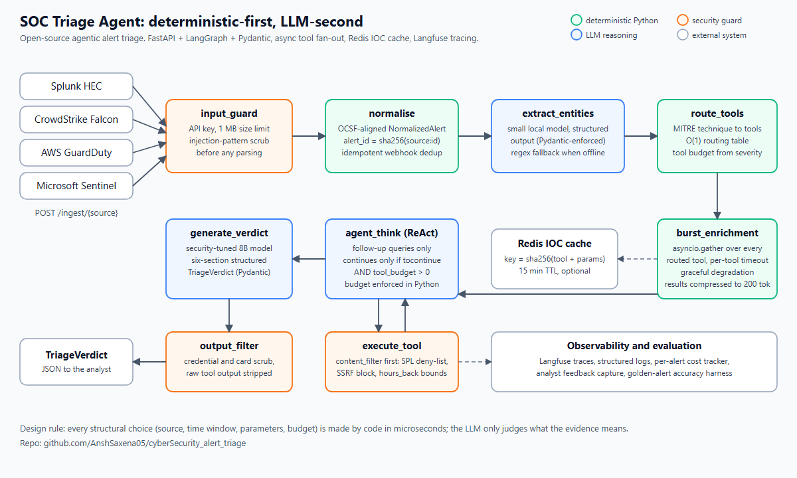

# RFC 0001: Deterministic-first triage and at-least-once durable ingest

| | |
|---|---|
| **Status** | Accepted. Routing, budget and guard layers are in `services/` and `security/`; the durable-ingest runtime lives in `services/_runtime/` (see its README for the per-module status). |
| **Author** | Ansh Saxena |
| **Scope** | How one alert travels from a webhook to a `TriageVerdict`, and what happens when something fails on the way. |
| **Related** | [architecture.md](../architecture.md), [api-reference.md](../api-reference.md), [`services/_runtime/README.md`](../../services/_runtime/README.md) |



## 1. Summary

Two decisions shape this service:

1. **Deterministic first, LLM second.** Code decides every structural choice (which tools run, over which time window, with which parameters, and how many calls are allowed). The model only judges what the evidence means.
2. **Durable at-least-once ingest.** A webhook is acknowledged only after a write-ahead record exists, and every later stage is idempotent, so a crash or a redelivery never loses or duplicates an investigation.

## 2. Motivation

Alert triage is a latency-sensitive, adversarial workload.

- **LLMs are bad at lookups and good at judgement.** When the model picks the source, the look-back window and the query parameters, a bad guess silently changes the answer and cannot be reproduced. Those choices are lookups.
- **Alert payloads are attacker-controlled text.** Anything the model reads can contain instructions. Anything the model can call must be bounded by code it cannot talk its way past.
- **Webhooks retry and brokers fail.** A SIEM resends on timeout, and a message broker can be down for minutes. The service must answer `202` quickly without losing the alert.

## 3. Part A: deterministic-first triage

### 3.1 Two phases

| Phase | Owner | Work | Target |
|---|---|---|---|
| 1. Fast path | Python plus a small local model in structured-output mode | Normalise, extract typed entities, look up tools, fan out enrichment | under 2 s |
| 2. Deep path | LLM | Follow-up tool calls only if evidence is missing, then the six-section verdict | under 60 s |

The targets are design budgets, not measured guarantees. The golden-alert harness in `evaluation/` is what checks quality.

### 3.2 Routing is a table, not a prompt

`services/mitre_router.py` maps a MITRE technique ID to a `RoutingEntry` (ordered tools, look-back window, parallel-burst flag, priority tool).

- Lookup is O(1). An unknown sub-technique (`T1003.999`) falls back to its parent (`T1003`), then to a default route.
- Multi-technique alerts merge their tool lists with `dict.fromkeys`, so priority tools come first, order is stable and duplicates are gone.
- Time windows are constants (48 h for lateral movement, 14 d for authentication, 30 d for C2 beaconing, and so on). During the burst the model never sets `hours_back`.

### 3.3 Burst fan-out, then a budgeted loop

`burst_enrichment_node` runs every routed tool at once with `asyncio.gather`, each under its own timeout. A slow or failing source returns `source_available: False` instead of failing the alert (graceful degradation). Results are compressed to about 200 tokens before the model sees them.

The ReAct loop that follows is for follow-ups only. It continues when all three hold: the model set `tocontinue`, the last message has tool calls, and `tool_budget > 0`. The budget comes from severity (LOW 3, MEDIUM 5, HIGH 8, CRITICAL effectively unbounded) and is decremented in Python. **The model cannot raise its own budget.**

### 3.4 Guard layers

| Layer | Runs | Blocks |
|---|---|---|
| `input_guard` | before parsing | missing API key, payloads over 1 MB, known injection patterns |
| `content_filter` | before every tool call | destructive SPL keywords, SSRF targets such as the cloud metadata IP, `hours_back` outside 1 to 8760 |
| `output_filter` | before logging or returning | credential and card patterns, raw tool output |

A prompt-injected "run this raw SPL" is stopped by `content_filter`, not by asking the model to behave.

### 3.5 Idempotent, cached enrichment

`alert_id = sha256(source:source_alert_id)`, so a duplicate webhook produces the same ID. Tool results are cached in Redis under `sha256(tool + sorted params)` with a 15 minute TTL; sorting makes the key order-independent, and a hit skips the external call and keeps tool budget. If Redis is down the cache disables itself and the pipeline carries on.

## 4. Part B: durable, at-least-once ingest

### 4.1 Write-ahead log, then publish

```
POST /ingest -> SET pending_alert:{id} (WAL) -> publish to JetStream, await ack
   ok   -> DEL pending_alert:{id} -> 202
   fail -> keep WAL entry         -> 202 (the reconciler retries)
```

A background reconciler scans `pending_alert:*`, retries with per-key exponential backoff so one poison alert cannot monopolise the loop, and moves an entry to a dead-letter stream after `max_age_seconds` (default 24 h). Several API processes can run reconcilers at once: a Redis `SET NX` lease key stops two of them publishing the same alert.

### 4.2 Idempotency at two layers

- JetStream de-duplicates on `Nats-Msg-Id == alert_id`.
- The LangGraph checkpointer is keyed by `thread_id == alert_id`, so a redelivered message resumes from the last completed super-step instead of restarting.

Either layer alone is enough for correctness; both are cheap, so both stay.

### 4.3 Worker contract

A pull consumer with a bounded batch only asks for more work when it has capacity (backpressure). Poison messages are terminated, transient errors are NAK'd for redelivery, and a `kill -9` mid-graph leaves an un-acked message and a partial checkpoint that the next worker resumes. Tenant identity comes only from the verified service JWT; a lint rule (`scripts/lint_tenant_id.py`) fails CI on any read of a tenant ID from a payload.

### 4.4 Ordering and cancellation

- Each published event carries a per-alert monotonic `event_seq` from a Redis `INCR`. A late subscriber reads the snapshot's `last_seq` and replays from `last_seq + 1`, which removes the snapshot-then-subscribe race.
- Cancellation is a Redis flag set after a short debounce, so a closed-and-reopened tab does not kill an in-flight investigation. The worker checks the flag at every LLM-call boundary and exits cleanly.

## 5. Failure modes

| Failure | Behaviour |
|---|---|
| Broker down at ingest | Alert is in the WAL, client gets `202`, reconciler publishes later |
| Same webhook delivered twice | Same `alert_id`; dedup window and checkpoint thread absorb it |
| Worker killed mid-graph | Message redelivered, graph resumes from its checkpoint |
| Enrichment source times out | `source_available: False` for that tool; verdict is built from the rest |
| Redis unavailable | The IOC cache disables itself and the pipeline carries on; with `ingest_via_nats=false` the in-process ingest path still runs |
| LLM unavailable | Heuristic entity extraction and a fallback verdict (the offline demo shows this path) |
| Prompt injection in an alert | Scrubbed at `input_guard`; any dangerous tool call blocked by `content_filter` |
| Alert that never publishes | Backoff, then DLQ after 24 h with a `stuck_alert` log line |

## 6. Alternatives considered

| Option | Why not |
|---|---|
| Let the LLM choose tools, windows and parameters | Not reproducible, and the attack surface is the model's judgement |
| One large prompt, no loop | Cannot ask a follow-up question when the first evidence is thin |
| Unbounded agent loop | Cost and latency grow with the model's confidence in itself; the budget makes both predictable |
| Publish straight to the broker, no WAL | Loses alerts during a broker outage, or forces the API to fail when the broker does |
| Exactly-once delivery | Needs coordination the workload does not justify; at-least-once plus idempotency gives the same outcome |

## 7. Trade-offs

- The routing table must be maintained as MITRE techniques grow. The fallback to the parent technique bounds the cost of a gap.
- Compressing tool output to about 200 tokens loses detail. The raw payload is kept for audit, and the verdict cites tool records.
- The WAL adds a Redis write to every ingest. That cost buys never losing an acknowledged alert.

## 8. Open questions

- Per-tenant budget overrides for regulated customers.
- Replacing the fixed look-back windows with a learned window per technique, validated against the golden set.
- A property-based test that replays random duplicate and crash schedules against the worker.
